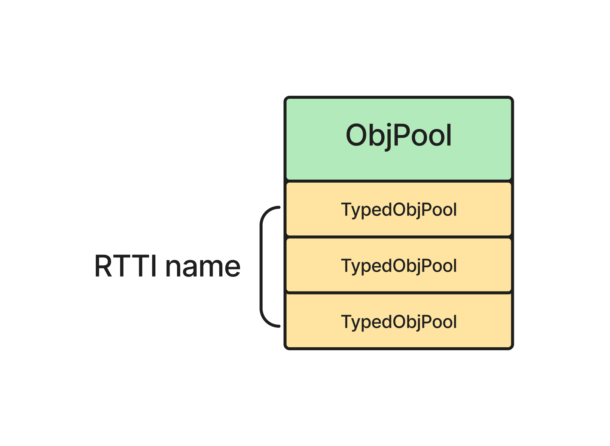
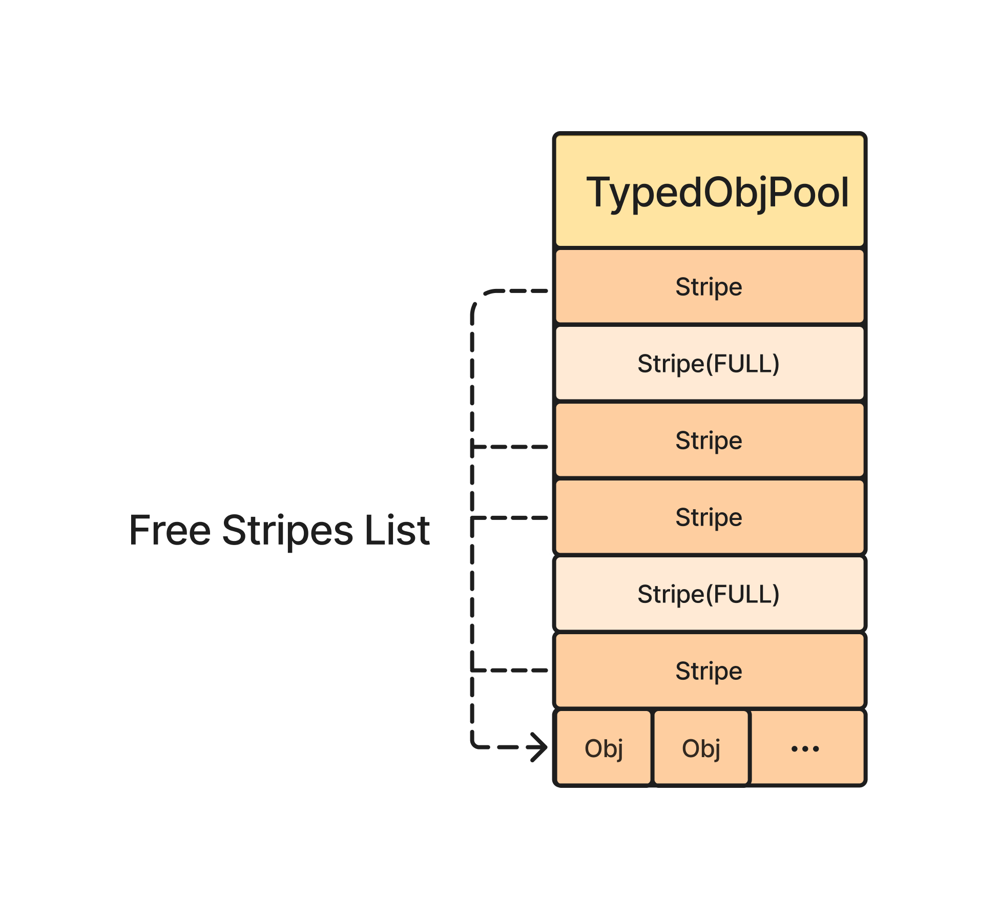
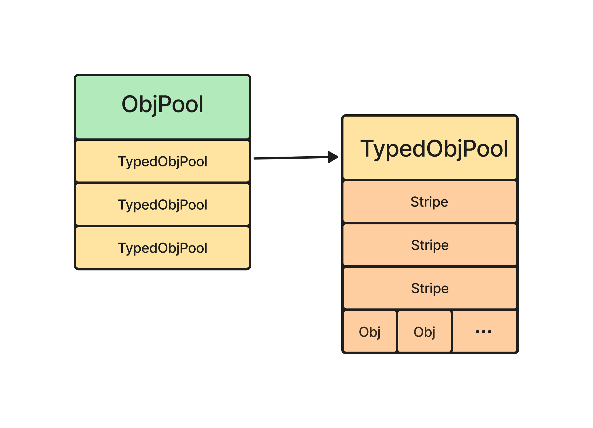

# 对象池 - LLBC_ObjPool

## 使用示例
1. 申请释放对象: 最常见的使用方式, 申请某一类型的对象, 使用完毕后归还到对象池中.

```cpp
LLBC_ObjPool objPool;
auto str = objPool.Acquire<std::string>();
objPool.Release(str);

auto packet = objPool.Acquire<LLBC_Packet>();
objPool.Release(packet);
```

2. 申请 Guarded 对象: 在作用域中申请, 离开作用域释放. 原理是申请返回的是 `LLBC_GuaredPoolObj` 栈对象, 重载 `operator * / operator ->`, 离开作用域时析构将实际对象归还对象池.

```cpp
{
	LLBC_ObjPool objPool;
	auto testObj = objPool.AcquireGuarded<ReflectMethTest>();
}
```

3. 对象支持复用: 为避免对象构造析构开销, 对象实现方法, 支持编译器反射(SFINAE)决定对象回收时不执行析构, 而是调用服用方法.

```cpp
// 支持的反射方法
// clear / Clear
// reset / Reset
// reuse / Reuse
class ReusableClass
{
public:
	void Reuse() {}
}

LLBC_ObjPool objPool;
auto c = objPool.Acquire<ReusableClass>();
objPool.Release(c);
```

## 对象池结构
### ObjPool



ObjPool 使用 RTTI name 作为 key 管理所有 TypedObjPool.

```cpp
// 申请对象时, 根据对象类型找到对应的 TypedObjPool
template <typename Obj> Obj *Acquire()
{
	auto* typedObjPool = GetTypedObjPool<Obj>();
	return typedObjPool->Acquire(); 
}

// ObjPool 维护了以 RTTI name 为 key 的所有 TypedObjPool
LLBC_TypedObjPool<Obj> *LLBC_ObjPool::GetTypedObjPool()
{
	static const LLBC_CString rttiName(typeid(Obj).name());
	return _typedObjPools[rttiName];
}
```
### TypedObjPool

TypedObjPool 以 Stripe(条带) 的方式维护 Obj. 每个条带有 Capacity(默认 1024) 个 Obj. 这样的好处是:
1. 连续内存, cache-friendly.
2. 批量分配, 批量释放.
3. 如果对象没有复用方法, 会将对象进行析构, 但仍 hold 住所在内存块, 下次申请时进行 placement new, 减少 malloc / free 系统调用.
   因此 LLBC_Obj 不仅是对象池, 同时也是内存池.

```cpp
void LLBC_TypedObjPool<Obj>::Release(Obj *obj)
{
    if constexpr (LLBC_ObjReflector::IsReusable<Obj>())
        LLBC_ObjReflector::Reuse<Obj>(wrappedObj->buff);
    else
    {
        LLBC_ObjReflector::Delete<Obj>(wrappedObj->buff);
        wrappedObj->unFlags.flags.constructed = false;
    }
}
```

### 整体结构


### 使用场景
LLBC 对象池设计的核心目的是减少对象频繁创建/销毁带来的构造析构和系统调用的开销, 以及减少内存的碎片化.
适合的使用场景: 大小相对固定的的对象, 高频创建释放.
例如: 网络包头, 可复用交互 option.

反之不适合的使用场景: 大小不固定的对象, 低频使用.
例如: vector 等 stl 容器, 内部会再在堆上申请内存.

