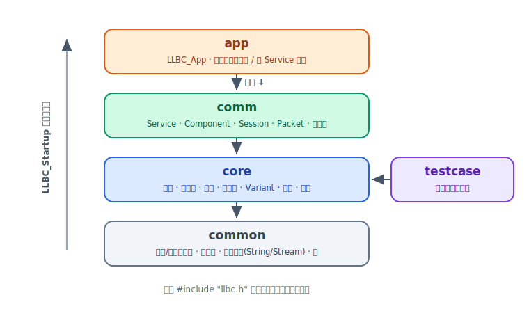

# 架构总览

llbc 是一个跨平台的 C++17 服务端框架，围绕 **Service + Component** 模型组织游戏 / 服务器逻辑。
本页介绍框架的模块划分、统一初始化流程，以及 App → Service → Component 的整体运行模型。

## 五大模块

C++ 核心库位于 `llbc/`，按职责拆分为五个模块，每个模块都有独立子目录与一个 `Module.h` 伞头文件：



| 模块 | 路径 | 职责 |
|------|------|------|
| `common` | `llbc/include/llbc/common/` | 平台 / 编译器抽象、错误码、基础类型（`LLBC_String`、`LLBC_Stream`）、`__LLBC_NS_BEGIN/END` 等宏 |
| `core` | `llbc/include/llbc/core/` | 网络之外的一切：线程、定时器、日志、对象池、`LLBC_Variant`、文件 / 目录、配置（ini/xml/properties）、事件管理、rapidjson、tinyxml2、编码转换 |
| `comm` | `llbc/include/llbc/comm/` | Service / Component / Session / Packet 网络层，可插拔 poller 后端，协议栈 |
| `testcase` | `llbc/include/llbc/testcase/` | 供 `tests/` 交互式项目使用的极小基类 |
| `app` | `llbc/include/llbc/app/` | `LLBC_App` 生命周期（启动、reload、停止），编排多个 Service |

## 一个头文件引入全部

`llbc.h`（位于 `llbc/include/llbc.h`）按 **依赖顺序** 包含五大模块：

```cpp
#include "llbc/common/Common.h"        // common
#include "llbc/core/Core.h"            // core
#include "llbc/comm/Comm.h"            // comm
#include "llbc/testcase/BaseTestCase.h"// testcase
#include "llbc/app/App.h"              // app
```

即 common → core → comm → testcase → app。业务代码只需 `#include "llbc.h"` 一行即可获得整个框架。

## 统一初始化：Startup / Cleanup

每个模块都暴露内部的 `__LLBC_<Module>Startup()` / `__LLBC_<Module>Cleanup()`。
`llbc.cpp` 中的 `LLBC_Startup()` / `LLBC_Cleanup()` 会按依赖顺序依次调用它们：

```cpp
#include "llbc.h"
using namespace llbc;

int main()
{
    LLBC_Startup();                 // 按 common→core→comm→testcase→app 顺序初始化
    LLBC_Defer(LLBC_Cleanup());     // 作用域退出时逆序清理

    // ... 业务代码 ...
    return 0;
}
```

<div class="callout warning" markdown="1">
**务必成对调用** `LLBC_Startup()` 与 `LLBC_Cleanup()`，且置于进程边界。
绝大多数公共 API 都假设库已初始化——未初始化即调用属于未定义行为。
详见 [Hello World](../getting-started/hello-world.md)。
</div>

## App → Service → Component

框架的运行模型是三层组合：

- **`LLBC_App`**（`app` 模块）——进程级生命周期与多 Service 编排。子类重写 `OnStart()` / `OnStop()`
  等钩子，负责创建并注册 Service；同时统一处理进程级的停止与配置 reload 事件。
- **`LLBC_Service`**（`comm` 模块）——一个自带线程（或外部驱动）的执行单元，承载网络会话、
  定时器、事件、以及一组 Component，按固定 FPS 逐帧驱动。
- **`LLBC_Component`**（`comm` 模块）——业务逻辑的载体。以 `LLBC_Component` 子类的形式挂载到 Service，
  由 Service 回调其生命周期钩子（`OnInit` / `OnStart` / `OnUpdate` / `OnStop` …）与事件钩子（`OnEvent`）。

App 不是必需的：可以只用 `LLBC_Service::Create(...)` 独立创建并驱动一个 Service。详见
[Service 与 Component](service-component.md) 与 [第一个 Service](../getting-started/first-service.md)。

## 关键约定（速览）

- **命名空间**：所有公共类型都在 `llbc` 命名空间中。用 `__LLBC_NS_BEGIN` / `__LLBC_NS_END`
  开合（不要裸写 `namespace llbc {}`）；内部私有命名空间为 `__llbc`，用 `__LLBC_INTERNAL_NS_BEGIN/END`。
- **符号前缀**：公共类型 / 函数 / 宏一律以 `LLBC_` 前缀（如 `LLBC_Service`、`LLBC_OK`）；
  内部 / 私有符号用双下划线 `__LLBC_` 或 `LLBC_INTERNAL_`，不应出现在公共头文件里。
- **返回约定**：多数 API 返回 `LLBC_OK`（0）或 `LLBC_FAILED`（-1），失败细节通过
  `LLBC_GetLastError()` / `LLBC_FormatLastError()` 获取（由 `LLBC_SetLastError()` 设置）。
  不要自造 ad-hoc 返回码。
- **可见性**：对外 API 需标注 `LLBC_EXPORT`（来自 `common/Export.h`）。

## 下一步

- [Service 与 Component](service-component.md)：如何创建 Service、挂载 Component、订阅消息。
- [生命周期与事件](lifecycle-event.md)：Component 各生命周期钩子的调用顺序与事件机制。
- [第一个 Service](../getting-started/first-service.md)：从零跑通一个 Service。
