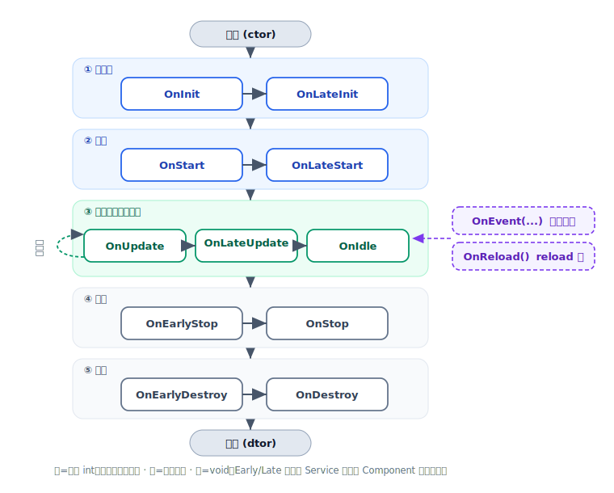

# 生命周期与事件

挂载到 Service 的 `LLBC_Component` 由框架按固定顺序回调一组 **生命周期钩子**；运行期的非流程化
通知（会话创建 / 销毁、异步连接结果、自定义事件等）则统一走 `OnEvent()`，配置热更走 `OnReload()`。
本页梳理这些钩子的真实名字、调用时机与调用顺序。

## 生命周期钩子

以下签名均来自 `llbc/include/llbc/comm/Component.h`，全部为虚函数，按需重写即可（默认实现为空 /
返回 `LLBC_OK`）。返回 `int` 的钩子返回 `LLBC_OK` 表示成功、`LLBC_FAILED` 表示失败并中断启动流程。
带 `bool &finished` 出参的钩子支持 **分帧完成**：置 `false` 表示尚未完成，框架下一帧会再次回调，
直到你置 `true`。

| 钩子 | 签名 | 时机 |
|------|------|------|
| `OnInit` | `int OnInit(bool &finished)` | 初始化（构造之后）。返回非 `LLBC_OK` 会中断 |
| `OnLateInit` | `int OnLateInit(bool &finished)` | 所有 Component `OnInit` 完成之后 |
| `OnStart` | `int OnStart(bool &finished)` | Service 启动，进入运行态前 |
| `OnLateStart` | `int OnLateStart(bool &finished)` | 所有 Component `OnStart` 完成之后 |
| `OnEarlyStop` | `void OnEarlyStop(bool &finished)` | 停止流程开始，`OnStop` 之前 |
| `OnStop` | `void OnStop(bool &finished)` | 停止 |
| `OnEarlyDestroy` | `void OnEarlyDestroy(bool &finished)` | 销毁流程开始，`OnDestroy` 之前 |
| `OnDestroy` | `void OnDestroy(bool &finished)` | 销毁（析构前） |
| `OnUpdate` | `void OnUpdate()` | 每帧调用一次 |
| `OnLateUpdate` | `void OnLateUpdate()` | 每帧 `OnUpdate` 之后 |
| `OnIdle` | `void OnIdle(const LLBC_TimeSpan &idleTime)` | 本帧有空闲时间时，`idleTime` 为剩余时间 |
| `OnReload` | `void OnReload()` | 配置 reload 时 |
| `OnEvent` | `void OnEvent(int eventType, const LLBC_Variant &eventParams)` | 收到组件事件时 |

### 调用顺序

一个 Component 从生到死的典型顺序：



```
构造
  → OnInit → OnLateInit                         // 初始化阶段
  → OnStart → OnLateStart                        // 启动阶段
  → [ 每帧循环: OnUpdate → OnLateUpdate → OnIdle ]   // 运行阶段
  →           OnEvent(...) 按需穿插触发
  →           OnReload() 在 reload 时触发
  → OnEarlyStop → OnStop                         // 停止阶段
  → OnEarlyDestroy → OnDestroy                    // 销毁阶段
析构
```

<div class="callout note" markdown="1">
`OnInit`/`OnStart` 等成对的“Early/Late”钩子作用在 **Service 内所有 Component 的批次维度** 上：
框架先对所有 Component 调 `OnInit`，全部完成后再统一进入 `OnLateInit`，`OnStart`/`OnLateStart` 同理。
这让你能在 `OnLateStart` 里安全地假设“同 Service 的其它 Component 都已 `OnStart` 完毕”。
</div>

## 非流程化事件：OnEvent()

运行期的通知（会话创建 / 销毁、异步连接结果、协议报告、未处理包，以及业务自定义事件）
不再各有独立虚函数，而是 **统一通过 `OnEvent()` 分发**。事件类型见 `LLBC_ComponentEventType`：
库级事件（`SessionCreate`、`SessionDestroy`、`AsyncConnResult`、`ProtoReport`、`UnHandledPacket`、
以及 `AppWillStart` 等 App 事件）位于 `[LibBegin, LibEnd)`，业务自定义事件从 `LogicBegin` 起。

```cpp
class MyComp : public LLBC_Component
{
public:
    void OnEvent(int eventType, const LLBC_Variant &eventParams) override
    {
        switch (eventType)
        {
            case LLBC_ComponentEventType::SessionCreate:
                OnSessionCreate(*eventParams.As<LLBC_SessionInfo *>());
                break;
            case LLBC_ComponentEventType::SessionDestroy:
                OnSessionDestroy(*eventParams.As<LLBC_SessionDestroyInfo *>());
                break;
            default:
                break;
        }
    }
};
```

业务层也可复用这套机制来做 Component 间的事件派发——自定义一个从 `LogicBegin` 起的枚举，
用 `Service::AddComponentEvent(eventType, params)` 投递，下一帧会分发到各 Component 的 `OnEvent()`：

```cpp
class MyCompEventType
{
public:
    enum { MyEv1 = LLBC_ComponentEventType::LogicBegin, MyEv2 };
};

GetService()->AddComponentEvent(MyCompEventType::MyEv1, LLBC_Variant(10086));
```

## 配置热更：OnReload()

配置 reload 时框架回调 Component 的 `OnReload()`；在其中通过 `GetConfig()` 读取最新配置：

```cpp
void MyComp::OnReload() override
{
    const LLBC_Variant &cfg = GetConfig();
    // 依据新配置刷新内部状态 ...
}
```

<div class="callout important" markdown="1">
**v1.1.1 的两处标准化**（见仓库 `CHANGELOG` 第 17、26 条）：

- 第 17 条：Component 方法收敛——非流程化事件处理统一通过 `OnEvent()` 完成，业务层也可复用
  Component Event 机制做事件派发。
- 第 26 条：标准化 App reload 概念与实现——原先冗长的 `OnAppConfigReloaded()` **已被移除**，
  改用 `OnReload()`。迁移旧代码时把 `OnAppConfigReloaded()` 重命名为 `OnReload()` 即可。
</div>

## 一个最小子类示例

```cpp
class GreetComp : public LLBC_Component
{
public:
    int OnInit(bool &finished) override
    {
        LLBC_PrintLn("GreetComp: init");
        return LLBC_OK;
    }

    int OnStart(bool &finished) override
    {
        LLBC_PrintLn("GreetComp: start");
        return LLBC_OK;
    }

    void OnUpdate() override
    {
        // 每帧逻辑（可通过 GetService()->SetFPS(...) 动态调帧率）
    }

    void OnStop(bool &finished) override
    {
        LLBC_PrintLn("GreetComp: stop");
    }
};
```

## 参照

- 头文件：`llbc/include/llbc/comm/Component.h`
- 示例：`tests/func_test/comm/FuncTest_Comm_SvcBase.cpp`（含 `OnInit`/`OnStart`/`OnUpdate`/`OnEvent` 重写）
- 迁移日志：仓库根 `CHANGELOG`（第 17、26 条）

## 下一步

- [Service 与 Component](service-component.md)：如何创建 Service 并挂载 Component。
- [第一个 Service](../getting-started/first-service.md)：动手把这些钩子跑起来。
