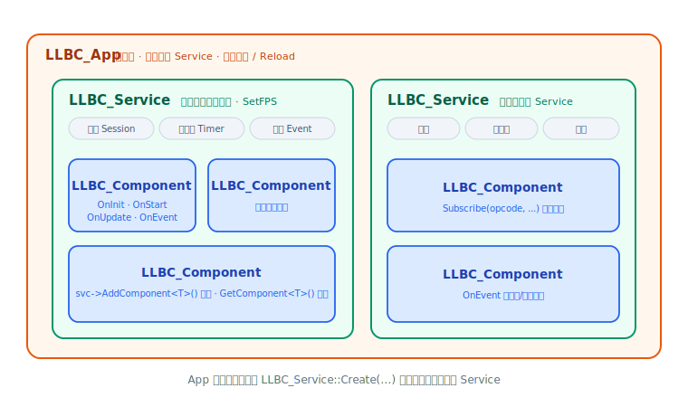

# Service 与 Component

`LLBC_Service` 是 llbc 的核心执行单元：它自带（或由外部驱动）一个逐帧循环，承载网络会话、
定时器、事件分发，以及一组挂载其上的 `LLBC_Component`。业务逻辑写在 Component 子类里，
由 Service 负责调度。本页介绍如何创建 Service、挂载 Component、订阅消息与事件。



## 创建 Service

Service 通过工厂方法 `LLBC_Service::Create()` 创建（返回堆对象，由调用方负责 `delete`）：

```cpp
// 签名：static LLBC_Service *Create(const LLBC_String &name = "",
//                                   LLBC_IProtocolFactory *dftProtocolFactory = nullptr,
//                                   bool fullStack = true);
LLBC_Service *svc = LLBC_Service::Create("MyService");
```

- `name`：Service 名字，可用于在 `LLBC_App` 中按名检索。
- `dftProtocolFactory`：默认协议工厂，`nullptr` 时使用框架内置协议栈。
- `fullStack`：是否使用完整协议栈（编解码 + 打包），默认为 `true`。

### 驱动模式

Service 有两种驱动模式（`LLBC_ServiceDriveMode`）：

- `SelfDrive`（默认）——Service 内部起一个线程，自动逐帧调用 `OnSvc()`，业务无需干预。
- `ExternalDrive`——由外部线程手动调用 `svc->OnSvc()` 来驱动，适合与已有主循环 / 引擎整合。

```cpp
svc->SetDriveMode(LLBC_ServiceDriveMode::ExternalDrive);
// 外部主循环中：svc->OnSvc();
```

帧率通过 `SetFPS()` / `GetFPS()` 控制（也可在 Component 的 `OnUpdate()` 中动态调整）。

## 挂载 Component

业务逻辑以 `LLBC_Component` 子类的形式挂载到 Service。`AddComponent` 有多个重载：

```cpp
class MyComp : public LLBC_Component
{
public:
    int OnStart(bool &startFinished) override
    {
        LLBC_PrintLn("MyComp started");
        return LLBC_OK;
    }
};

// 方式一：模板重载，框架内部 new（推荐）
svc->AddComponent<MyComp>();

// 方式二：传入已构造的实例（此后由 Service 托管其生命周期）
MyComp *comp = new MyComp;
svc->AddComponent(comp);

// 方式三：通过 LLBC_ComponentFactory 创建
svc->AddComponent(new MyCompFactory);
```

在任意 Component 内可通过 `GetService()` 拿回宿主 Service，并用 `GetComponent<T>()`
获取同一 Service 上的其它 Component：

```cpp
LLBC_Service *svc = GetService();
OtherComp *other = svc->GetComponent<OtherComp>();
```

Component 的生命周期钩子（`OnInit` / `OnStart` / `OnUpdate` / `OnStop` / `OnEvent` …）
详见 [生命周期与事件](lifecycle-event.md)。

## 启动与停止

```cpp
svc->Start();                 // 启动（默认 SelfDrive：内部起线程逐帧驱动）
// ... 运行期 ...
svc->Stop();                  // 停止；Stop(true) 会同时销毁 Component
delete svc;                   // Create 出来的对象需手动释放
```

`Start()` 可接收 `LLBC_ServiceStartArgs`（`pollerCount`、`loadSampleTime` 等）来指定 poller 数量。

## 可插拔的 Poller 后端

Service 的网络 I/O 由 poller 驱动，编译期按平台选择后端：

- `SelectPoller`——跨平台通用（可移植但性能一般）。
- `EpollPoller`——Linux 首选。
- `IocpPoller`——Windows 首选。

具体使用哪个由编译期配置宏 `LLBC_CFG_COMM_POLLER_MODEL` 决定，业务代码无需关心差异；
`Listen` / `Connect` / `AsyncConn` 等接口在所有后端上语义一致。

<div class="callout note" markdown="1">
macOS 目前仅有 `SelectPoller`，网络性能有所下降，不建议用于生产环境。
</div>

## 网络：会话与消息处理

Service 提供监听 / 连接接口，返回 session id（返回 0 表示失败，用 `LLBC_FormatLastError()` 看原因）：

```cpp
int listenSid = svc->Listen("127.0.0.1", 7788);       // 监听
int connSid   = svc->Connect("127.0.0.1", 7788);       // 同步连接
int asyncSid  = svc->AsyncConn("127.0.0.1", 7788);     // 异步连接
```

消息按 **opcode** 订阅到处理函数。处理函数签名为 `void(LLBC_Packet &)`：

```cpp
// 在初始化流程中，把 opcode=1 的消息路由到 comp 的成员方法
svc->Subscribe(1, comp, &MyComp::OnRecvData);
// 前置处理（返回 false 可中断后续处理流程）
svc->PreSubscribe(1, comp, &MyComp::OnPreRecvData);
```

Component 中的处理与回发示例（改编自 `tests/func_test/comm/FuncTest_Comm_SvcBase.cpp`）：

```cpp
void MyComp::OnRecvData(LLBC_Packet &packet)
{
    // 从对象池取一个回包，回发给来源 session
    LLBC_Packet *resp = GetService()->GetThreadSafeObjPool().Acquire<LLBC_Packet>();
    resp->SetHeader(packet.GetSessionId(), packet.GetOpcode(), 0);
    resp->Write("pong", 4);
    GetService()->Send(resp);
}
```

编解码可通过 `AddCoderFactory(opcode, factory)` 注册 `LLBC_Coder` 工厂，实现基于 opcode 的自动
编 / 解码。会话相关的通知（创建 / 销毁 / 异步连接结果等）不走 `Subscribe`，而是通过 Component 的
`OnEvent()` 分发，见 [生命周期与事件](lifecycle-event.md)。

## 参照

- 完整可运行示例：`tests/func_test/comm/FuncTest_Comm_SvcBase.cpp`（Service + Component + 编解码 + 收发）
- 头文件：`llbc/include/llbc/comm/Service.h`、`llbc/include/llbc/comm/Component.h`

## 下一步

- [生命周期与事件](lifecycle-event.md)：Component 钩子的调用顺序、`OnEvent()` 与 `OnReload()`。
- [第一个 Service](../getting-started/first-service.md)：动手跑通一个最小 Service。
- [架构总览](architecture.md)：模块划分与 App→Service→Component 全景。
