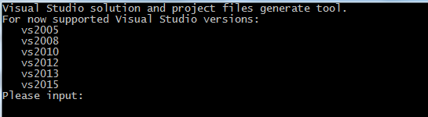
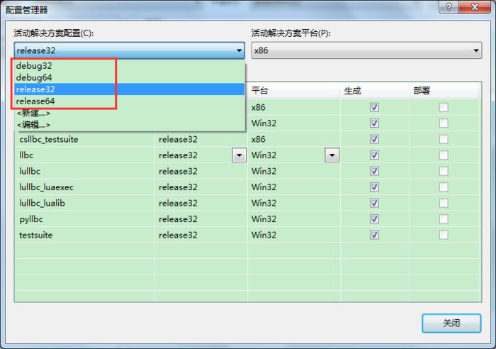
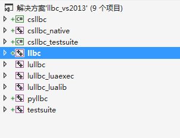

# 安装与构建

llbc 提供两条构建路径，按你的目标平台选择即可。本页先教你把**核心库**编译出来，
后续的 [Hello World](hello-world.md) 会直接链接它。

- **CMake**：Linux / macOS。构建 C++ 核心库与 `tests/` 四个测试项目。
- **Visual Studio**：Windows。

## 获取源码

```bash
git clone --recurse-submodules https://github.com/lailongwei/llbc.git
cd llbc
```

<div class="callout important" markdown="1">
**子模块**：`unit_test` 依赖 git 子模块 `tests/3rdparty/googletest`。普通 clone 下该目录
**存在但为空**，CMake 在配置阶段检测不到它时会**跳过 `unit_test` 目标**（其余目标照常构建）。
如需构建单元测试，务必带 `--recurse-submodules`，或在已有仓库中执行：

```bash
git submodule update --init tests/3rdparty/googletest
```
</div>

## 路径一：CMake（Linux / macOS）

要求 CMake **≥ 3.16**。构建 C++ 核心库（`llbc_lib` 静态库 + `llbc_lib_shared` 动态库）
与四个 `tests/` 项目（`example`、`func_test`、`unit_test`、`quick_start`）。

```bash
mkdir cmake_build && cd cmake_build
cmake ..
make -j4
```

产物统一落在 `output/cmake/`（平铺目录）：

- 核心库：`libllbc.a`（静态）、`libllbc.dylib` / `libllbc.so`（动态）。
- 测试程序：每个测试各产出静态链接与动态链接两个可执行文件，例如
  `unit_test` 与 `unit_test_shared`。

<div class="callout note" markdown="1">
默认构建类型为 **Release**。单配置生成器（Makefile / Ninja）下切换到 Debug 需在配置时指定：

```bash
cmake .. -DCMAKE_BUILD_TYPE=Debug
```

Debug 目标带 `_debug` 后缀（如 `libllbc_debug.a`、`unit_test_debug`）。
</div>

可选开关（配置时以 `-D<OPTION>=ON` 传入，均定义于 `tools/cmake/config.cmake`）：

| 开关 | 作用 |
|------|------|
| `LLBC_ENABLE_ASAN` | 启用 AddressSanitizer（非 Windows）。 |
| `LLBC_ENABLE_COVERAGE` | 启用 clang 源码级覆盖率插桩（非 MSVC）。 |
| `LLBC_DISABLE_CXX11_ABI` | 定义 `_GLIBCXX_USE_CXX11_ABI=0`。 |

## 路径二：Visual Studio（Windows）

1. 运行仓库根目录的 `WinPreBuild.bat`。

   

2. 输入一个 Visual Studio 版本（`vs2017`、`vs2019` 或 `vs2022`）。脚本会调用
   `tools/premake/premake5_windows.exe` 生成解决方案 `build/<vsXXXX>/llbc_<vsXXXX>.sln`。

   

3. 用 Visual Studio 打开生成的解决方案，选择配置后编译。

   

## 语言封装（Python / C# / Lua）

本页的 CMake 与 Visual Studio 两条路径只构建 C++ 核心库与测试项目，**不含**语言封装。
如需 `pyllbc` / `csllbc` / `lullbc`，需改用仓库根的 premake→make 构建（Linux/macOS）：

```bash
make wraps        # 全部封装
make py_wrap      # 仅 Python
make cs_wrap      # 仅 C#
make lu_wrap      # 仅 Lua
```

<div class="callout note" markdown="1">
封装依赖对应子模块：`wrap/pyllbc/cpython`（Python）、`wrap/lullbc/lua`（Lua）。
普通 clone 下它们存在但为空，务必先 `git submodule update --init --recursive`。
</div>

## 下一步

核心库编译成功后，前往 [Hello World](hello-world.md) 写下你的第一个 llbc 程序。
