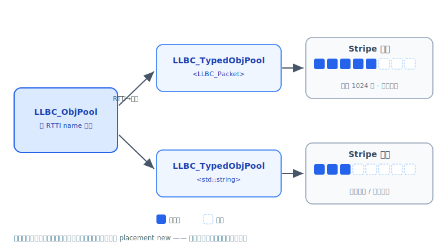

# 对象池 ObjPool

`LLBC_ObjPool` 是 llbc 的对象池（同时也是内存池）。它的核心目的是减少对象频繁创建 /
销毁带来的**构造 / 析构开销**与 **malloc / free 系统调用开销**，并降低内存碎片化。
按对象类型 `Acquire<T>()` 申请、`Release()` 归还，内部按类型分桶、按内存条带（Stripe）批量管理。

## 使用场景

适合：**大小相对固定、高频创建释放**的对象。例如网络包头、可复用的交互 option 等。

不适合：**大小不固定、低频使用**的对象。例如 `std::vector` 等 STL 容器——它们内部还会在堆上二次申请内存，
池化收益有限。

<div class="note" markdown="1">
派生自 `LLBC_Object` 的类型**不能**通过 `LLBC_ObjPool` 创建。`Acquire<T>()` 内有
`static_assert(!std::is_base_of_v<LLBC_Object, Obj>, ...)`，这类对象走自身的引用计数 / GC 机制。
</div>

## 三种使用方式

### 1. 申请 / 释放对象

最常见的方式：申请某一类型的对象，用完后归还到对象池。

```cpp
LLBC_ObjPool objPool;

auto str = objPool.Acquire<std::string>();
// ... 使用 str ...
objPool.Release(str);

auto packet = objPool.Acquire<LLBC_Packet>();
// ... 使用 packet ...
objPool.Release(packet);
```

### 2. 申请 Guarded 对象（作用域 RAII 归还）

在作用域中申请，离开作用域自动归还。`AcquireGuarded<T>()` 返回的是一个栈上的
`LLBC_GuardedPoolObj<T>`，它重载了 `operator*` / `operator->`，析构时把实际对象归还对象池：

```cpp
LLBC_ObjPool objPool;
{
    auto guarded = objPool.AcquireGuarded<ReflectMethTest>();
    guarded->SomeMethod();   // 通过 operator-> 访问
    (*guarded).field = 1;    // 通过 operator* 访问
}   // 离开作用域，guarded 析构，对象自动归还
```

`LLBC_GuardedPoolObj` 还提供 `Get()`（取裸指针）、`Detach()`（脱离守护、由调用方接管）、
`Reset()` 以及 `explicit operator bool()`（判断是否持有对象）。

### 3. 对象复用（不析构，调用复用方法）

为避免重复的构造 / 析构开销，若对象实现了约定的复用方法，则回收时**不执行析构**，
而是调用该复用方法把对象“清空”以待下次复用。是否可复用通过编译期反射（SFINAE）自动判定。

支持的复用方法名（存在其一即可，大小写均可）：

```cpp
// clear / Clear
// reset / Reset
// reuse / Reuse
```

例如：

```cpp
class ReusableClass
{
public:
    void Reuse() {}   // 存在此方法，回收时调用它而非析构
};

LLBC_ObjPool objPool;
auto c = objPool.Acquire<ReusableClass>();
objPool.Release(c);   // 不析构，调用 c->Reuse()
```

此外，`std::unordered_map` / `std::unordered_set` 以及带 `clear()` 的 STL 容器（如 `map` / `set`）
也被识别为可复用，回收时调用其 `clear()`。若对象**没有**任何复用方法，回收时会正常析构，但仍保留内存块（见下文）。

## 对象池结构



### ObjPool：按类型分桶

`LLBC_ObjPool` 以类型的 RTTI name 作为 key，管理各类型对应的 `LLBC_TypedObjPool<Obj>`。
`Acquire<Obj>()` 先按类型找到（或创建）对应的 typed 子池，再向其申请对象：

```cpp
template <typename Obj>
Obj *Acquire()
{
    static_assert(!std::is_base_of_v<LLBC_Object, Obj>,
                  "Obj can not create by ObjPool, as is derived from LLBC_Object");
    return GetTypedObjPool<Obj>()->Acquire();
}
```

### TypedObjPool：按 Stripe 条带管理

`LLBC_TypedObjPool<Obj>` 以 **Stripe（条带）** 的方式维护对象，每个条带默认容纳
`LLBC_CFG_CORE_OBJPOOL_STRIPE_CAPACITY`（默认 1024）个对象。这样设计的好处：

1. **连续内存，cache-friendly**：同一条带内对象地址连续。
2. **批量分配 / 批量释放**：以条带为单位向系统申请 / 归还内存。
3. **析构但保留内存块**：若对象没有复用方法，回收时会析构对象，但仍 hold 住所在内存块；
   下次申请同类型对象时直接在原地 placement new，避免再次 malloc / free。

正因为第 3 点，`LLBC_ObjPool` **既是对象池，也是内存池**。

<div class="note" markdown="1">
条带容量可按类型定制：为对象提供 `size_t GetStripeCapacity()` 方法，反射会读取它作为该类型的条带容量。
</div>

## 线程相关

`LLBC_ObjPool` 构造时可指定是否线程安全（`explicit LLBC_ObjPool(bool threadSafe = false)`）。
框架还提供每线程的 `LLBC_ThreadSpecObjPool`，通过 `SafeAcquire<T>()` / `UnsafeAcquire<T>()`
（及对应的 `SafeRelease` / `UnsafeRelease`、`GuardedSafeAcquire<T>()` / `GuardedUnsafeAcquire<T>()`）
使用当前线程的线程安全 / 线程非安全对象池，免去自行持有池实例。

## 参照

- 头文件：`llbc/include/llbc/core/objpool/ObjPool.h`、`llbc/include/llbc/core/objpool/ThreadSpecObjPool.h`
- 内联实现：`llbc/include/llbc/core/objpool/ObjPoolInl.h`
- 示例 / 测试：`tests/func_test/core/objpool/FuncTest_Core_ObjPool.cpp`
- 快速上手示例（可跑）：`tests/example/core/Example_Core_ObjPool.cpp`
