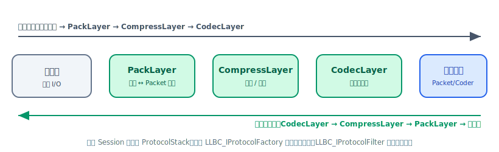

# 协议栈与自定义协议

llbc 的网络层在每个 Session 上挂载一条**协议栈（ProtocolStack）**，由若干协议层（ProtocolLayer）串联而成，负责完成字节流 ↔ 数据包的拆装，以及可选的压缩与编解码。通过实现 `LLBC_IProtocolFactory` 可以替换任意层的协议实现，也可以插入 `LLBC_IProtocolFilter` 对收发包做拦截过滤。



## 协议层枚举（LLBC_ProtocolLayer）

协议层按固定顺序排列，索引由 `LLBC_ProtocolLayer` 定义：

| 枚举值 | 索引 | 职责 |
|--------|------|------|
| `PackLayer` | 0 | 字节流 ↔ `LLBC_Packet` 拆装（帧头解析）|
| `CompressLayer` | 1 | 压缩 / 解压 |
| `CodecLayer` | 2 | 业务对象编解码（序列化/反序列化）|

发送方向：`CodecLayer → CompressLayer → PackLayer → 字节流`
接收方向：`字节流 → PackLayer → CompressLayer → CodecLayer`

```cpp
// 检查层合法性 / 获取层名称
LLBC_ProtocolLayer::IsValid(LLBC_ProtocolLayer::PackLayer);     // true
LLBC_ProtocolLayer::Layer2Str(LLBC_ProtocolLayer::CodecLayer);  // "CodecLayer"
```

## ProtocolStack 的三种模式

`LLBC_ProtocolStack` 有三种 `StackType`：

- `PackStack`：仅包含 PackLayer（用于 Raw 模式服务，直接收发二进制块）。
- `CodecStack`：仅包含 CodecLayer（对已拆好的包做编解码）。
- `FullStack`：PackLayer + CompressLayer + CodecLayer，即完整协议栈（Normal 模式服务默认）。

框架内置两个开箱即用的工厂：

```cpp
// Normal 模式：FullStack，框架自动处理帧头拆装 + 编解码
LLBC_Service *svc = LLBC_Service::Create("MyApp",
    new LLBC_NormalProtocolFactory);

// Raw 模式：PackStack only，收发裸字节块，业务自行解析
LLBC_Service *svc = LLBC_Service::Create("MyApp",
    new LLBC_RawProtocolFactory);
```

<div class="callout note" markdown="1">
**PacketProtocol 默认帧头格式（20 字节）：**

| 字段 | 偏移 | 长度 |
|------|------|------|
| Length（含头） | 0 | 4 |
| Opcode | 4 | 4 |
| Status | 8 | 2 |
| Flags | 10 | 2 |
| ExtData1 | 12 | 8 |

替换 PackLayer 即可采用不同的帧格式。
</div>

## IProtocol 接口

每个协议层实现 `LLBC_IProtocol`，核心方法只有三个：

```cpp
class LLBC_EXPORT LLBC_IProtocol
{
public:
    virtual int  GetLayer() const = 0;
    // 发送方向：in/out 类型随层约定（见下文）
    virtual int  Send(void *in, void *&out, bool &removeSession) = 0;
    // 接收方向
    virtual int  Recv(void *in, void *&out, bool &removeSession) = 0;
    // 控制命令透传，返回 true 继续向下传递，返回 false 截断
    virtual bool Ctrl(int cmd, const LLBC_Variant &ctrlData, bool &removeSession);
};
```

`removeSession` 是输出参数：返回 `-1` 时若置为 `true`，框架将关闭该会话。

## IProtocolFactory 与自定义协议

为每个连接（Listen / Connect 调用）指定工厂，工厂按层返回协议实例：

```cpp
class MyProtoFactory final : public LLBC_IProtocolFactory
{
public:
    LLBC_IProtocol *Create(int layer) const override
    {
        switch (layer)
        {
            case LLBC_ProtocolLayer::PackLayer:
                return new MyPackProtocol();     // 自定义帧格式
            case LLBC_ProtocolLayer::CompressLayer:
                return new LLBC_CompressProtocol(); // 框架内置
            case LLBC_ProtocolLayer::CodecLayer:
                return new LLBC_CodecProtocol();    // 框架内置
            default:
                return nullptr;
        }
    }
};
```

将工厂传入 Listen / Connect / Create：

```cpp
// 服务级别默认工厂（所有会话共享）
LLBC_Service *svc = LLBC_Service::Create("App", new MyProtoFactory);

// 单会话独立工厂（优先级高于服务级别工厂）
int sid = svc->Listen("0.0.0.0", 7788, new MyProtoFactory);
```

## 自定义 PackLayer 骨架

替换 PackLayer 的最常见场景是使用私有帧格式或在拆包时注入额外校验：

```cpp
class MyPackProtocol final : public LLBC_PacketProtocol
{
public:
    // 覆盖 Ctrl 可响应业务下发的控制命令
    bool Ctrl(int cmd, const LLBC_Variant &ctrlData,
              bool &removeSession) override
    {
        LLBC_PrintLn("MyPackProtocol::Ctrl cmd=%d", cmd);
        return false; // 不再向更底层传递
    }
    // Send / Recv 如需完全自定义帧格式，需同时覆盖这两个方法
};
```

## 协议栈控制命令（Ctrl）

通过 `LLBC_Service::CtrlProtocolStack` 向指定会话的协议栈下发自定义命令，命令从最顶层向下依次调用每层的 `Ctrl()`，直至某层返回 `false` 截断：

```cpp
LLBC_Variant ctrlData;
ctrlData["key"] = "value";
svc->CtrlProtocolStack(sessionId, /*cmd=*/10086, ctrlData);
```

## IProtocolFilter 过滤器

`LLBC_IProtocolFilter` 可以插在任意协议层上，在包经过该层前做拦截判断：

```cpp
class MyFilter final : public LLBC_IProtocolFilter
{
public:
    // 返回 0 放行，返回 -1 丢弃该包
    int FilterSend(const LLBC_Packet &pkt) override { return 0; }
    int FilterRecv(const LLBC_Packet &pkt) override { return 0; }
    // 返回 0 接受连接，返回 -1 关闭连接
    int FilterConnect(const LLBC_SockAddr_IN &local,
                      const LLBC_SockAddr_IN &peer) override { return 0; }
};
```

<div class="callout warning" markdown="1">
`LLBC_IProtocolFilter` 目前没有公开的 `AddFilter` / `SetFilter` 入口位于 `LLBC_Service` 接口；过滤器通过 `LLBC_ProtocolStack::SetFilter(filter, layer)` 安装，而 `LLBC_ProtocolStack` 由框架内部管理。如需拦截逻辑，通常在自定义协议层的 `Send`/`Recv` 内部实现更为直接。
</div>

## 抑制编解码器未注册警告

当使用 Raw 模式或某些 opcode 故意不注册 Coder 时，可关闭框架的警告日志：

```cpp
svc->SuppressCoderNotFoundWarning();
```

<div class="callout note" markdown="1">
**线程安全：** 协议栈对象随 Session 生命周期存在于 Poller 线程，不应在业务线程直接操作 `LLBC_ProtocolStack` 成员。控制命令请使用 `LLBC_Service::CtrlProtocolStack`，它是线程安全的。
</div>

## 参照

- `llbc/include/llbc/comm/protocol/IProtocol.h` — 协议接口
- `llbc/include/llbc/comm/protocol/ProtocolLayer.h` — 层枚举
- `llbc/include/llbc/comm/protocol/ProtocolStack.h` — 栈管理
- `llbc/include/llbc/comm/protocol/IProtocolFactory.h` — 工厂接口
- `llbc/include/llbc/comm/protocol/IProtocolFilter.h` — 过滤器接口
- `llbc/include/llbc/comm/protocol/PacketProtocol.h` — 内置 PackLayer 实现
- `llbc/include/llbc/comm/protocol/NormalProtocolFactory.h` / `RawProtocolFactory.h` — 内置工厂
- 真实用例：`tests/func_test/comm/FuncTest_Comm_ProtoStackCtrl.cpp`
- 真实用例：`tests/func_test/comm/FuncTest_Comm_Svc.cpp`（Normal vs Raw 工厂选择）

## 下一步

- [Service 与 Component](../concepts/service-component.md) — 了解 `LLBC_Service` 的完整生命周期
- [序列化 Stream](stream.md) — 与 CodecLayer 配合使用的数据包序列化
