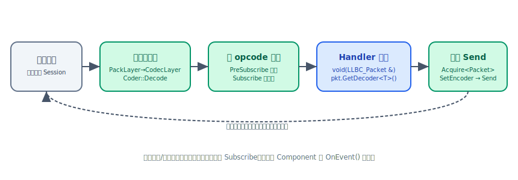

# Service 消息处理与 Handler

`LLBC_Service` 通过 **opcode 路由表**将收到的网络包分发给对应的处理函数（Handler）。
业务代码用 `Subscribe` 把一个成员函数或 delegate 绑定到某个 opcode，框架在网络包
到达并经过协议栈解码后，自动调用该函数并传入 `LLBC_Packet &`。
`PreSubscribe` 可在主处理函数之前插入前置过滤逻辑；`AddCoderFactory` 则让框架
按 opcode 自动实例化并调用 `LLBC_Coder::Decode`，处理函数直接取解码对象，无需手写
`packet >>` 散落代码。



## Subscribe：注册 opcode 处理函数

每个 opcode 只能绑定一个主处理函数。最常见形式是绑定到 Component 成员方法：

```cpp
// 成员方法形式：Subscribe(opcode, obj, &Class::Method)
svc->Subscribe(1, comp, &MyComp::OnRecvData);

// delegate 形式（lambda、自由函数均可）
svc->Subscribe(2, LLBC_Delegate<void(LLBC_Packet &)>([](LLBC_Packet &pkt) {
    // ...
}));
```

处理函数签名固定为 `void(LLBC_Packet &)`。

## 从 Packet 读取数据

`LLBC_Packet` 提供 `>>` 运算符（内部调用 `Read`），按写入顺序逐字段消费 payload。
包头元数据（会话 ID、opcode、状态码）通过 getter 直接读取：

```cpp
void MyComp::OnRecvData(LLBC_Packet &pkt)
{
    // 读取包头元数据
    int sessionId = pkt.GetSessionId();   // 来源会话 ID
    int opcode    = pkt.GetOpcode();      // opcode（与 Subscribe 注册的一致）
    int status    = pkt.GetStatus();      // 状态码，默认 0

    // 顺序读出 payload 字段
    uint64      playerId;
    LLBC_String playerName;
    int         level;
    pkt >> playerId >> playerName >> level;
}
```

<div class="callout note" markdown="1">
`>>` 和 `Read()` 都沿读游标顺序消费，不能回退或随机定位。若注册了
`AddCoderFactory`，则框架在回调前已自动调用 `Decode`，直接用
`GetDecoder<T>()` 取对象即可，无需再手动 `>>`（见下一节）。
</div>

## AddCoderFactory：自动编解码

将 `LLBC_CoderFactory` 与 opcode 绑定后，框架在收到该 opcode 的包时会自动
分配 `LLBC_Coder` 实例并调用 `Decode`；处理函数通过 `GetDecoder<T>()` 取出已
解码的业务对象：

```cpp
// 定义 Coder
struct TestData final : public LLBC_Coder
{
    int         iVal;
    LLBC_String strVal;

    bool Encode(LLBC_Packet &pkt) override { pkt << iVal << strVal; return true; }
    bool Decode(LLBC_Packet &pkt) override { pkt >> iVal >> strVal; return true; }
};

// 定义工厂
struct TestDataFactory final : public LLBC_CoderFactory
{
    LLBC_Coder *Create() const override { return new TestData; }
};

// 注册（在 Start() 之前调用）
svc->AddCoderFactory(/*opcode=*/1, new TestDataFactory);
// 或模板形式，框架内部 new：
svc->AddCoderFactory<TestDataFactory>(/*opcode=*/1);
```

处理函数中直接取解码对象：

```cpp
void MyComp::OnRecvData(LLBC_Packet &pkt)
{
    TestData *data = pkt.GetDecoder<TestData>();
    LLBC_PrintLn("iVal=%d strVal=%s", data->iVal, data->strVal.c_str());
}
```

<div class="callout note" markdown="1">
`LLBC_Coder` 继承自 `LLBC_PoolObj`，框架在处理完毕后统一回收，业务代码无需 delete。
</div>

## 取回包并发送

在处理函数中构建应答包时，优先从 Service 的**线程不安全对象池**（Service 线程内）
或**线程安全对象池**（跨线程）获取 `LLBC_Packet`，避免频繁堆分配：

```cpp
void MyComp::OnRecvData(LLBC_Packet &pkt)
{
    TestData *data = pkt.GetDecoder<TestData>();

    // 构造回包：复用收包 sessionId 和 opcode
    TestData *resData  = new TestData;
    resData->iVal  = data->iVal;
    resData->strVal = data->strVal;

    LLBC_Packet *res = GetService()->GetThreadSafeObjPool().Acquire<LLBC_Packet>();
    res->SetHeader(pkt.GetSessionId(), pkt.GetOpcode(), /*status=*/0);
    res->SetEncoder(resData);   // 框架 Send 时调用 Encode，之后自动 delete encoder

    GetService()->Send(res);    // 无论成功与否，res 所有权转移给框架
}
```

也可以直接通过便捷重载发送 Coder 或原始字节，无需手动构造 Packet：

```cpp
// 以 Coder 发包（框架内部取 Packet 并调用 Encode）
svc->Send(sessionId, /*opcode=*/1, resData, /*status=*/0);

// 以原始字节发包
svc->Send(sessionId, /*opcode=*/2, buf, len);
```

<div class="callout important" markdown="1">
使用默认 `NormalProtocolFactory` 发送原始字节、且该 opcode **未**通过
`AddCoderFactory` 注册 Coder 时，必须在 `Start()` 前调用
`svc->SuppressCoderNotFoundWarning()`。否则 `CodecProtocol` 会丢弃收包，
`Subscribe` 的 Handler 不会被调用。若注册了 CoderFactory，则不需要抑制。
</div>

<div class="callout important" markdown="1">
无论 `Send` 成功与否，`LLBC_Packet *` 和 `LLBC_Coder *` 的所有权在调用后
立即归框架管理；调用方绝不能在 `Send` 后再访问这两个指针。
</div>

## PreSubscribe：前置过滤

`PreSubscribe` 在 `Subscribe` 主处理函数之前执行。返回 `false` 则中止后续处理流程
（主处理函数不会被调用）：

```cpp
// 注册前置过滤（与 Subscribe 同一 opcode）
svc->PreSubscribe(1, comp, &MyComp::OnPreRecvData);

// 实现：返回 false 可丢弃该包
bool MyComp::OnPreRecvData(LLBC_Packet &pkt)
{
    TestData *data = pkt.GetDecoder<TestData>();
    if (data->iVal < 0)
        return false;  // 非法数据，中止处理

    // 将预处理结果挂到 pkt，主处理函数通过 GetPreHandleResult<T>() 取用
    pkt.SetPreHandleResult(LLBC_Malloc(char, 64), [](void *p){ free(p); });
    return true;
}
```

<div class="callout note" markdown="1">
若编译时开启了 `LLBC_CFG_COMM_ENABLE_UNIFY_PRESUBSCRIBE`，还可以调用
`UnifyPreSubscribe` 注册全局前置过滤，对所有 opcode 生效，签名相同：
`bool(LLBC_Packet &)`。
</div>

## 状态码处理

若编译时开启了 `LLBC_CFG_COMM_ENABLE_STATUS_HANDLER`，可为
`(opcode, status)` 组合注册单独的处理函数；注册后框架不再调用该 opcode
的默认主处理函数：

```cpp
// 注册状态码处理函数
svc->SubscribeStatus(/*opcode=*/1, /*status=*/1, comp, &MyComp::OnStatus_1);

void MyComp::OnStatus_1(LLBC_Packet &pkt)
{
    LLBC_PrintLn("opcode=%d status=%d", pkt.GetOpcode(), pkt.GetStatus());
}
```

## 会话事件通知

会话建立 / 断开等非消息事件不走 `Subscribe` 路由，而是通过 `LLBC_Component::OnEvent`
回调分发。组件内部按 `eventType` 分支处理：

```cpp
void MyComp::OnEvent(int eventType, const LLBC_Variant &eventParams) override
{
    switch (eventType)
    {
        case LLBC_ComponentEventType::SessionCreate:
        {
            auto *info = eventParams.As<LLBC_SessionInfo *>();
            LLBC_PrintLn("Session created: %s", info->ToString().c_str());
            break;
        }
        case LLBC_ComponentEventType::SessionDestroy:
        {
            auto *info = eventParams.As<LLBC_SessionDestroyInfo *>();
            LLBC_PrintLn("Session destroyed: %s", info->ToString().c_str());
            break;
        }
        default:
            break;
    }
}
```

业务逻辑也可以用 `AddComponentEvent` 向组件投递自定义事件：

```cpp
// eventType 值从 LLBC_ComponentEventType::LogicBegin 开始定义
GetService()->AddComponentEvent(MyCompEv1, LLBC_Variant("hello"));
```

详细事件类型定义参见 [组件生命周期与事件](../concepts/lifecycle-event.md)。

## 参照

- 头文件：`llbc/include/llbc/comm/Service.h` / `ServiceInl.h`
- 头文件：`llbc/include/llbc/comm/Packet.h` / `PacketInl.h`
- 头文件：`llbc/include/llbc/comm/Coder.h`
- 功能测试（完整收发 + PreSubscribe + CoderFactory 示例）：`tests/func_test/comm/FuncTest_Comm_SvcBase.cpp`
- 快速上手示例（可跑）：`tests/example/comm/Example_Comm_ServiceMessaging.cpp`

## 下一步

- Packet 编解码细节：[Packet 与 Coder 编解码](packet-coder.md)
- 二进制序列化：[序列化 Stream](stream.md)
- 组件生命周期与事件：[组件生命周期与事件](../concepts/lifecycle-event.md)
- Service 与 Component 概念：[Service 与 Component](../concepts/service-component.md)
