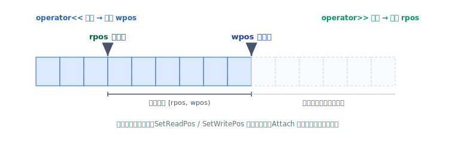

# 序列化 Stream

`LLBC_Stream` 是 llbc 的二进制序列化容器，用 `<<` 写入、`>>` 读出，支持基础类型、
STL 容器、以及自定义类型。v1.1.1 起 `LLBC_Stream` **读写游标分离**（读位置与写位置独立），
旧的“单一位置游标”假设不再成立。

## 基础类型

```cpp
LLBC_Stream stream;

// 可选：设置字节序（默认本机序；网络传输常用网络序）
stream.SetEndian(LLBC_Endian::NetEndian);

// 写入
stream << true          // bool
       << -32           // int32
       << 32u           // uint32
       << -64ll         // int64
       << 64llu         // uint64
       << 3.14f         // float
       << 6.28          // double
       << "Hello World!"; // 字符串

// 读出（顺序与写入一致）
bool b; sint32 i32; uint32 u32; sint64 i64; uint64 u64;
float f; double d; LLBC_String s;
stream >> b >> i32 >> u32 >> i64 >> u64 >> f >> d >> s;
```

## 游标控制



读写游标独立，可分别定位：

```cpp
stream.SetWritePos(0);   // 重置写游标（覆盖写）
stream.SetReadPos(0);    // 重置读游标（重新读）
```

轻量“附着”到另一个 stream（不拷贝底层数据）：

```cpp
LLBC_Stream stream2;
stream2.Attach(stream);
```

## STL 容器

嵌套容器可直接读写：

```cpp
std::vector<std::map<LLBC_String, std::set<int>>> data = {
    { { "Key1", {1, 2, 3} }, { "Key2", {4, 5, 6} } }
};

LLBC_Stream stream;
decltype(data) out;
stream << data;
stream.SetReadPos(0);
stream >> out;
```

## 自定义类型

为你的类型提供 `Serialize` / `Deserialize` 成员，即可像基础类型一样用 `<<` / `>>`：

```cpp
struct PlayerData
{
    uint64      playerId;
    LLBC_String playerName;
    int         level;

    void Serialize(LLBC_Stream &stream) const
    {
        stream << playerId << playerName << level;
    }

    bool Deserialize(LLBC_Stream &stream)
    {
        stream >> playerId >> playerName >> level;
        return true;   // 返回 false 表示反序列化失败
    }
};

// 使用
PlayerData in{9527llu, "Judy", 99}, out;
LLBC_Stream stream;
stream << in;
stream.SetReadPos(0);
stream >> out;
```

`LLBC_Packet` 的读写与 `LLBC_Stream` 一致，因此上述自定义类型可直接用于网络收发。

## 参照

- 完整示例：`tests/quick_start/stream/QuickStart_Stream.cpp`
- 头文件：`llbc/include/llbc/common/`（Stream 属于 common 模块）

> TODO：补充版本兼容/前后兼容策略、`LLBC_Variant` 与 Stream 的互转、性能与预分配建议。
