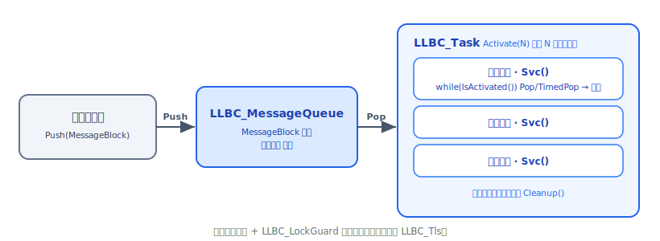

# 线程与任务

llbc 的线程层提供三组能力：以 `LLBC_Task` 为核心的任务队列模型、由 `LLBC_ThreadMgr` 管理的底层线程句柄、以及一套锁/守卫/TLS 工具。绝大多数业务代码只需继承 `LLBC_Task`、通过 `Push`/`Pop` 收发消息；只有在需要精细控制线程生命周期时才直接使用 `LLBC_ThreadMgr`。



## LLBC_Task：任务模型

`LLBC_Task` 是 llbc 的线程任务基类。调用 `Activate` 启动若干工作线程，每条线程独立运行 `Svc()`；所有线程退出后框架调一次 `Cleanup()` 进行收尾。派生类必须实现这两个纯虚方法。

```cpp
class MyTask final : public LLBC_Task
{
public:
    void Svc() override
    {
        LLBC_MessageBlock *block = nullptr;
        while (IsActivated())
        {
            TimedPop(block, 200);  // 超时 200 ms，防止 Svc 永久阻塞
            if (!block) continue;
            // 处理 block ...
            delete block;
        }
    }
    void Cleanup() override { /* 资源清理 */ }
};

MyTask task;
task.Activate(4);  // 启动 4 条工作线程，默认 Normal 优先级
// 向任务推送消息（见下节）
task.Wait();       // 等待所有线程结束（Svc 全部返回后触发 Cleanup）
```

`GetTaskState()` 返回 `LLBC_TaskState` 枚举值（`NotActivated / Activating / Activated / Deactivating`），可用 `LLBC_TaskState::GetDesc(state)` 转为可读字符串。

<div class="callout warning" markdown="1">
`Activate` 与 `Wait` 不可重入：同一 `LLBC_Task` 对象同一时刻只能处于一次激活周期。`Svc()` 内部用 `IsActivated()` 判断任务是否仍处于 `Activated` 状态来控制退出逻辑。
</div>

## LLBC_MessageBlock 与消息收发

`LLBC_MessageBlock` 是消息队列的最小传输单元，封装一段连续缓冲区，读写游标独立。

```cpp
// 生产方：序列化数据，写入 MessageBlock，推入 Task
LLBC_Stream stream;
stream.Write(LLBC_String().format("msg #%d", i));
LLBC_MessageBlock *block = new LLBC_MessageBlock;
block->Write(stream.GetBuf(), stream.GetWritePos());
task.Push(block);   // 线程安全，内部走 LLBC_MessageQueue

// 消费方（在 Svc() 内）：
LLBC_MessageBlock *blk = nullptr;
task.Pop(blk);                                     // 阻塞直到有消息
LLBC_Stream in(blk->GetData(), blk->GetReadableSize());
LLBC_String msg; in.Read(msg);
delete blk;
```

`Task` 还提供 `TryPop`（非阻塞）和 `TimedPop(block, ms)`（带超时），以及 `PopAll` 一次取出全部块（结果以单向链表形式通过 `GetNext()` 遍历）。`GetMessageSize()` 返回队列中待处理块数量。

## LLBC_MessageQueue 独立使用

`LLBC_MessageQueue` 可脱离 `LLBC_Task` 单独使用，支持双端插入与弹出。

```cpp
LLBC_MessageQueue q;

// 生产（任意线程）
LLBC_MessageBlock *blk = new LLBC_MessageBlock;
blk->Write("hello", 5);
q.PushBack(blk);          // 也可 PushFront

// 消费（阻塞等待）
LLBC_MessageBlock *out = nullptr;
q.PopFront(out);          // 阻塞直到有数据

// 非阻塞尝试：返回 true 表示取到数据
if (q.TryPopFront(out)) { /* 有数据 */ delete out; }

// 超时 200 ms
if (q.TimedPopFront(out, 200)) { /* 有数据 */ delete out; }
```

<div class="callout note" markdown="1">
`PopAll` 通过出参传出链表头指针（返回值是 `bool`/`int` 表示是否成功），调用方需循环 `GetNext()` 并逐一 `delete` 节点，不要整体释放。
</div>

## LLBC_ThreadMgr：底层线程管理

`LLBC_ThreadMgr` 以单例形式暴露，通过宏 `LLBC_ThreadMgrSingleton` 访问。通常由 `LLBC_Task` 内部调用，业务代码也可直接创建原始线程。

```cpp
// 创建 3 条线程，同属一个 group handle
LLBC_Handle grp = LLBC_ThreadMgrSingleton->CreateThreads(
    3,
    [](void *) { /* 线程体 */ },
    nullptr,                        // arg
    LLBC_ThreadPriority::Normal
);

// 等待整组线程结束
LLBC_ThreadMgrSingleton->WaitGroup(grp);

// 静态工具方法（任意线程均可调用）
LLBC_ThreadId  tid    = LLBC_ThreadMgr::CurThreadId();
bool           inLlbc = LLBC_ThreadMgr::InLLBCThread();
LLBC_Handle    grpH   = LLBC_ThreadMgr::CurGroupHandle();
```

线程启动/停止钩子：

```cpp
LLBC_ThreadMgrSingleton->SetThreadStartHook(
    [](LLBC_Handle h) { /* 线程刚启动时回调 */ });
LLBC_ThreadMgrSingleton->SetThreadStopHook(
    [](LLBC_Handle h) { /* 线程即将退出时回调 */ });
```

<div class="callout warning" markdown="1">
`Cancel/CancelGroup/CancelAll` 依赖平台线程强制取消语义（POSIX `pthread_cancel` / Win32 `TerminateThread`），可能导致资源泄漏。推荐通过向消息队列推送哨兵消息，让 `Svc()` 主动退出，而非强制取消。
</div>

## 锁类型一览

所有互斥锁均继承 `LLBC_ILock` 接口（`Lock() / TryLock() / Unlock()`），可与 `LLBC_LockGuard` 搭配使用。

| 类型 | 底层实现 | 适用场景 |
|------|---------|---------|
| `LLBC_SimpleLock` | 系统互斥量 (mutex) | 通用互斥，等待时让出 CPU |
| `LLBC_RecursiveLock` | 递归互斥量 | 同一线程可重入加锁的场景 |
| `LLBC_FastLock` | x86 汇编 CAS 或系统 mutex | 极短临界区，x86/x64 架构最优 |
| `LLBC_SpinLock` | 自旋锁 | 临界区极短、不希望发生线程调度的场景 |
| `LLBC_DummyLock` | 空实现（无操作） | 模板参数占位，单线程场景 |

`LLBC_RWLock` 提供独立的读写接口（不继承 `LLBC_ILock`）：

```cpp
LLBC_RWLock rwLock;

// 读者（允许并发）
rwLock.ReadLock();
// ... 读共享数据 ...
rwLock.ReadUnlock();

// 写者（独占）
rwLock.WriteLock();
// ... 修改共享数据 ...
rwLock.WriteUnlock();

// 非阻塞变体：bool ReadTryLock() / bool WriteTryLock()
```

## LLBC_LockGuard 与各类守卫

`LLBC_LockGuard` 以 RAII 方式管理任意 `LLBC_ILock` 的加解锁，防止异常或提前 `return` 时忘记解锁。

```cpp
LLBC_SimpleLock lock;

{
    LLBC_LockGuard guard(lock);   // 构造时 Lock()
    // 临界区操作
}                                 // 析构时 Unlock()

// reverse=true：构造时 Unlock()，析构时 Lock()（罕用，适合临时解锁）
LLBC_LockGuard reverseGuard(lock, /*reverse=*/true);
```

其余守卫类用于生命周期管理，均在析构时自动执行对应操作：

```cpp
SomeClass *p = new SomeClass;
LLBC_DeleteGuard<SomeClass> dg(p);   // 析构时 delete p，并将 p 置 nullptr

void *mem = malloc(64);
LLBC_FreeGuard<void> fg(mem);        // 析构时 free(mem)

// 离开作用域时调用任意可调用对象
LLBC_InvokeGuard ig([]() { LLBC_PrintLn("cleanup triggered"); });

// 绑定成员函数：
LLBC_InvokeGuard ig2(obj, &MyClass::Cleanup, arg);
```

## LLBC_Tls：线程局部存储

`LLBC_Tls<T>` 是平台无关的 TLS 封装，每个线程持有独立的 `T*`，通过 `operator*` 和 `operator->` 透明访问。

```cpp
static LLBC_Tls<int> g_tls;   // 全局/静态声明

// 在每条线程中（通常在线程入口或首次使用前）：
g_tls.SetValue(new int(0));    // 分配本线程专属存储（旧值会被自动 delete）
(*g_tls) += 1;                 // 解引用访问
LLBC_PrintLn("tls = %d", *g_tls);
g_tls.ClearValue();            // 清除并 delete 当前线程的值
```

<div class="callout important" markdown="1">
`SetValue` 的第二个参数 `valueClearMeth` 控制旧值的释放方式：`LLBC_TlsValueClearMeth::Delete`（默认，用 `delete`）或 `LLBC_TlsValueClearMeth::Free`（用 `free`）。若 TLS 持有的指针由 `malloc` 分配，必须显式传入 `Free`，否则行为未定义。`LLBC_Tls` 对象本身不管理跨线程的析构——线程结束时若未调 `ClearValue()`，该线程分配的存储将泄漏。
</div>

## 参照

头文件：
- `llbc/include/llbc/core/thread/Task.h` / `TaskInl.h`
- `llbc/include/llbc/core/thread/ThreadMgr.h`
- `llbc/include/llbc/core/thread/MessageQueue.h`
- `llbc/include/llbc/core/thread/MessageBlock.h`
- `llbc/include/llbc/core/thread/Guard.h` / `GuardInl.h`
- `llbc/include/llbc/core/thread/SpinLock.h`、`SimpleLock.h`、`RecursiveLock.h`、`FastLock.h`、`RWLock.h`
- `llbc/include/llbc/core/thread/Tls.h` / `TlsInl.h`

真实测试示例：
- `tests/func_test/core/thread/FuncTest_Core_Thread_Task.cpp`
- `tests/func_test/core/thread/FuncTest_Core_Thread_Lock.cpp`
- `tests/func_test/core/thread/FuncTest_Core_Thread_RWLock.cpp`
- `tests/func_test/core/thread/FuncTest_Core_Thread_Tls.cpp`
- 快速上手示例（可跑）：`tests/example/core/Example_Core_Thread.cpp`

## 下一步

- [对象池](objpool.md) — 高频消息场景中 `LLBC_MessageBlock` 可与对象池结合，减少 `malloc` 开销
- [Variant 万能值](variant.md) — 跨线程传递结构化数据时的另一种载体选择
