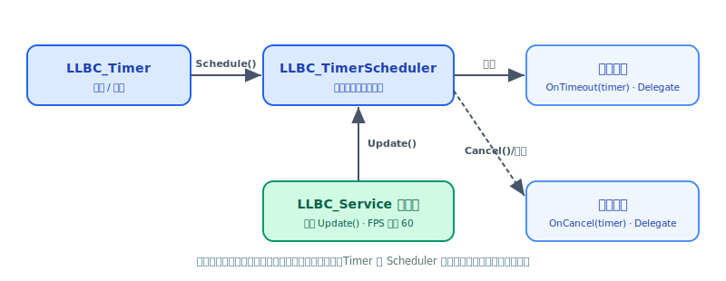

# 定时器 Timer

`LLBC_Timer` 是 llbc 的单体定时器类，支持单次触发与周期触发，通过 `LLBC_Delegate`
注册超时与取消回调。定时器不自驱动——它依附于一个 `LLBC_TimerScheduler`；
在 Service 逻辑线程内构造的定时器自动使用 Service 帧驱动的调度器，无需手动推进。



## 创建定时器

最简单的方式是直接栈构造或堆构造，再通过 `SetTimeoutHandler` 设置回调：

```cpp
// 栈上创建，生命周期由当前作用域管理
LLBC_Timer timer;
timer.SetTimeoutHandler([](LLBC_Timer *t) {
    LLBC_PrintLn("timeout! triggered:%zu", t->GetTriggeredCount());
});

// 也可在构造时传入 delegate
LLBC_Timer timer2(
    [](LLBC_Timer *t) { LLBC_PrintLn("timeout"); },
    [](LLBC_Timer *t) { LLBC_PrintLn("cancelled"); }
);
```

若需在成员函数中使用，推荐对象方法重载：

```cpp
class MyComp : public LLBC_Component {
    LLBC_Timer _heartbeatTimer;
public:
    int OnInit(bool &finished) override {
        _heartbeatTimer.SetTimeoutHandler(this, &MyComp::OnHeartbeat);
        _heartbeatTimer.Schedule(LLBC_TimeSpan::oneSec);
        return LLBC_OK;
    }
    void OnHeartbeat(LLBC_Timer *t) {
        LLBC_PrintLn("heartbeat #%zu", t->GetTriggeredCount());
    }
};
```

## 启动与取消

`Schedule` 有两个重载，分别接受 **时间点**（`LLBC_Time`）和 **时间段**（`LLBC_TimeSpan`）
作为首次触发时刻：

```cpp
// 500 ms 后首次触发，此后每 1 s 触发一次，触发 5 次后自动停止
timer.Schedule(LLBC_TimeSpan::FromMillis(500),
               LLBC_TimeSpan::oneSec,
               5);

// period 缺省 zero => 使用 firstPeriod 作为重复周期
timer.Schedule(LLBC_TimeSpan::oneSec);          // 每秒一次，无限重复

// firstPeriod = zero => 下一帧立即触发，之后按 period 周期重复
timer.Schedule(LLBC_TimeSpan::zero, LLBC_TimeSpan::FromMillis(200));

// 按绝对时间指定首次触发（time >= LLBC_Time::Now()）
timer.Schedule(LLBC_Time::Now() + LLBC_TimeSpan::oneSec * 3);

// 取消
timer.Cancel();
```

<div class="callout note" markdown="1">
`triggerCount` 传 0 会被规整为 1（触发一次）；默认值 `LLBC_INFINITE` 表示无限重复。
`period` 传 `LLBC_TimeSpan::zero` 时，实际周期等于 `firstPeriod`。
</div>

## 单次定时器

设置 `triggerCount = 1` 可实现"延迟执行一次"语义，触发后定时器自动停止调度：

```cpp
auto *t = new LLBC_Timer;
t->SetTimeoutHandler([](LLBC_Timer *timer) {
    LLBC_Defer(delete timer);       // 触发后自销毁
    LLBC_PrintLn("one-shot fired");
});
t->Schedule(LLBC_TimeSpan::oneSec * 2, LLBC_TimeSpan::zero, 1);
```

## 超时回调与取消回调

两种回调均接收 `LLBC_Timer *` 参数，可通过 `LLBC_Delegate` 绑定 lambda、
自由函数或成员函数，也可子类化 `LLBC_Timer` 并重写 `OnTimeout()` / `OnCancel()`：

```cpp
class MyTimer : public LLBC_Timer {
public:
    void OnTimeout() override {
        LLBC_PrintLn("MyTimer timeout, id=%llu period=%s",
                     GetTimerId(), GetPeriod().ToString().c_str());
    }
    void OnCancel() override {
        LLBC_PrintLn("MyTimer cancelled");
    }
};
```

取消回调的触发时机：

- 外部调用 `Cancel()` 时；
- 在超时回调内调用 `Cancel()` 时（此时 `IsHandlingTimeout()` 与 `IsHandlingCancel()` 同时为 true）。

```cpp
timer.SetCancelHandler([](LLBC_Timer *t) {
    // 取消时 IsScheduled() == false
    LLBC_PrintLn("cancelled, wasHandlingTimeout=%d", t->IsHandlingTimeout());
});
```

## 在超时回调中重新调度

在超时回调内直接调用 `Schedule` 可安全地改变周期或切换回调：

```cpp
timer.SetTimeoutHandler([](LLBC_Timer *t) {
    LLBC_PrintLn("first fire, switching to 100ms period");
    t->SetTimeoutHandler([](LLBC_Timer *t2) {
        LLBC_PrintLn("fast tick #%zu", t2->GetTriggeredCount());
    });
    // 重新调度后 IsHandlingTimeout() 立即变为 false
    t->Schedule(LLBC_TimeSpan::FromMillis(100));
});
timer.Schedule(LLBC_TimeSpan::oneSec);
```

## 查询定时器状态

```cpp
timer.GetTimerId();            // 返回当前定时器 ID；从未调度（_timerData 为空）时返回 0，取消后仍返回上次分配的 ID
timer.GetFirstPeriod();        // 首次触发间隔
timer.GetPeriod();             // 重复间隔
timer.GetTotalTriggerCount();  // 总触发次数（LLBC_INFINITE 表示无限）
timer.GetTriggeredCount();     // 已触发次数（未调度时返回 0）
timer.IsScheduled();           // 是否处于调度中
timer.IsHandlingTimeout();     // 当前是否正在执行超时回调
timer.IsHandlingCancel();      // 当前是否正在执行取消回调
timer.GetTimeoutTime();        // 仅在超时回调中有效，返回本次超时的预期时间
```

## 携带用户数据

每个 `LLBC_Timer` 实例内置一个 `LLBC_Variant` 类型的数据槽，可存储任意值：

```cpp
timer.GetTimerData() = 42;      // 存入整数

timer.SetTimeoutHandler([](LLBC_Timer *t) {
    int val = t->GetTimerData();  // 取回
    LLBC_PrintLn("data=%d", val);
});
```

## 与 Service 帧驱动的关系

`LLBC_TimerScheduler::Update()` 是定时器的驱动入口；
`LLBC_Service` 在每一帧的固定位置调用该函数，
因此 **在 Service 逻辑线程内构造的定时器无需任何额外配置**，
其精度取决于 Service FPS（默认 60）。

```cpp
// Service 逻辑线程外（如自定义线程）：需手动推进调度器
LLBC_TimerScheduler sched;
while (running) {
    sched.Update();
    LLBC_Sleep(1);
}

// 在 Service 线程中：构造即用，帧驱动自动推进
// new LLBC_Timer() 会自动关联当前线程的调度器
```

<div class="callout warning" markdown="1">
在非 llbc 风格线程（既非入口线程也非 Service 逻辑线程）中构造 `LLBC_Timer`
时，默认 `scheduler` 为 `nullptr`——此时必须在构造时显式传入一个自管理的
`LLBC_TimerScheduler *`，否则 `Schedule()` 会失败并返回 `-1`。
</div>

<div class="callout note" markdown="1">
**线程安全**：`LLBC_Timer` 与 `LLBC_TimerScheduler` 均不是线程安全的；
定时器的所有操作（`Schedule`、`Cancel`、回调执行）必须在同一线程中进行。
</div>

## 参照

- 头文件：`llbc/include/llbc/core/timer/Timer.h`、`llbc/include/llbc/core/timer/TimerScheduler.h`
- 真实示例：`tests/func_test/comm/FuncTest_Comm_Timer.cpp`
- App 阶段定时器示例：`tests/func_test/app/FuncTest_App_AppTimer.cpp`
- 快速上手示例（可跑）：`tests/example/core/Example_Core_Timer.cpp`

## 下一步

- [委托 Delegate](delegate.md) — 理解 `LLBC_Delegate` 的绑定方式
- [时间 Time](time.md) — `LLBC_Time` 与 `LLBC_TimeSpan` 常量参考
